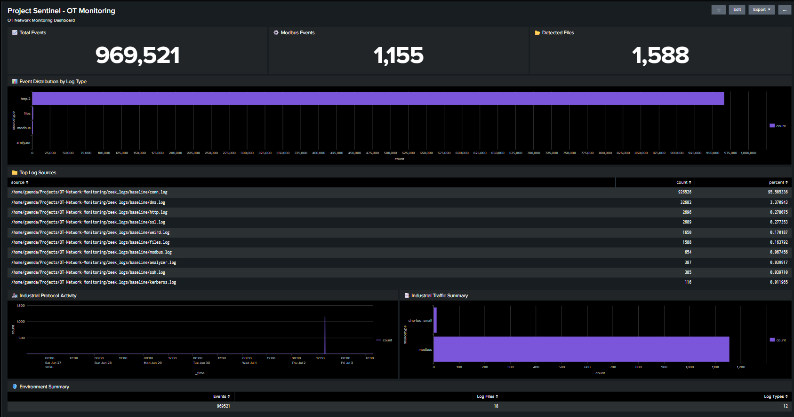
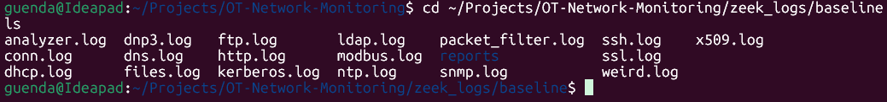
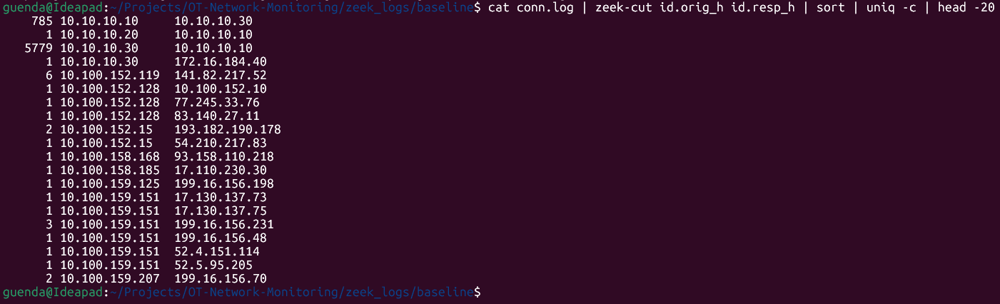
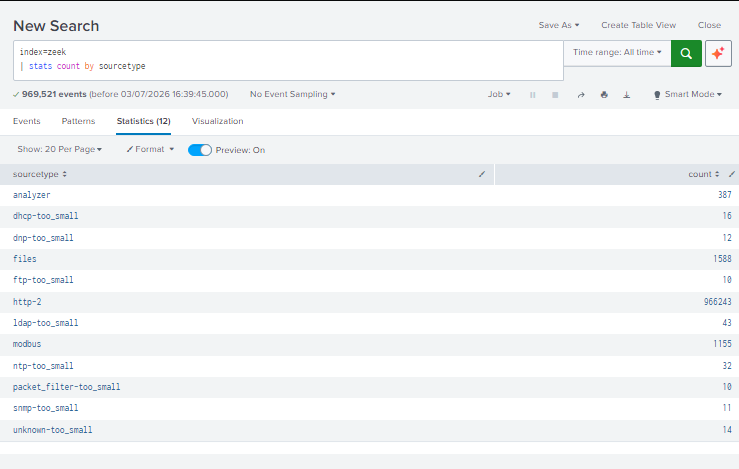
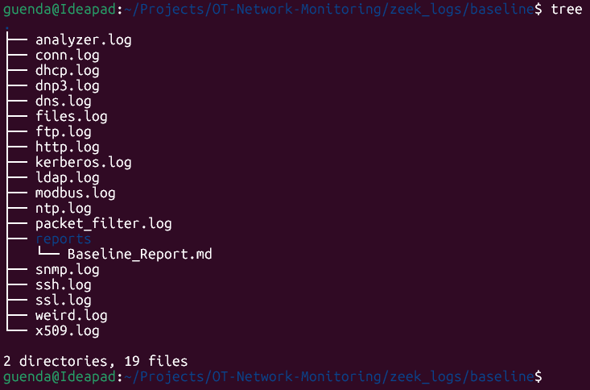

# 🛡️ Project Sentinel

## Passive Industrial Network Monitoring Platform

Project Sentinel is an Operational Technology (OT) network monitoring lab designed to demonstrate passive industrial network visibility using **Zeek** and **Splunk Enterprise**.

The project analyzes industrial network traffic captured in PCAP files, generates structured security telemetry using Zeek, and visualizes the results through Splunk dashboards to establish a baseline of normal network behavior and support threat detection.

---

# Objectives

- Monitor industrial network traffic without impacting operations.
- Generate structured network telemetry using Zeek.
- Build a security baseline for an OT environment.
- Visualize network activity using Splunk Enterprise.
- Demonstrate detection engineering concepts for industrial networks.

---

# Project Workflow

```text
Industrial PCAP
        │
        ▼
      Zeek
        │
        ▼
 Structured Network Logs
        │
        ▼
 Splunk Enterprise
        │
        ▼
 Baseline Analysis
        │
        ▼
 Detection Engineering
        │
        ▼
 OT Security Dashboard
```

---

# Architecture

```
                    Internet
                        │
                Corporate Firewall
                        │
              Corporate IT Network
                        │
                  OT Firewall
                        │
                Industrial Switch
        ┌────────┬─────────┬─────────┐
        │        │         │         │
      PLC-01   PLC-02     HMI   Engineering WS
                        │
                  SPAN / Mirror Port
                        │
                  Zeek Monitoring Sensor
                        │
                    Zeek Logs
                        │
                 Splunk Enterprise
                        │
              SOC Dashboard & Alerts
```

---

# Technologies

| Technology | Purpose |
|------------|---------|
| Zeek | Network Security Monitoring |
| Splunk Enterprise | SIEM & Dashboarding |
| Ubuntu (WSL2) | Analysis Environment |
| Git & GitHub | Version Control |
| Markdown | Documentation |

---

# Repository Structure

```
Project-Sentinel/
│
├── docs/
├── reports/
├── screenshots/
├── scripts/
├── splunk/
├── pcaps/
├── zeek_logs/
└── README.md
```

---

# Features

- Passive OT network monitoring
- Zeek log generation
- Baseline network analysis
- Asset inventory creation
- Splunk dashboard
- Detection engineering use cases
- Technical documentation

---

# Dashboard

The Splunk dashboard provides a centralized view of the monitored OT environment, allowing analysts to quickly assess network activity and protocol usage.

Key metrics include:

- 📈 Total Network Events
- 📂 Observed Files
- ⚙️ Modbus Events
- 📊 Event Distribution by Log Type
- 📁 Top Log Sources
- 🏭 Industrial Protocol Activity
- 🛡️ Environment Summary



---

# Zeek Log Generation

Zeek was used to process industrial PCAP files and generate structured network telemetry for analysis.



---

# Baseline Analysis

The baseline was established by analyzing network communications, identifying active hosts, and understanding normal traffic patterns.



---

# Splunk Investigation

Example Splunk searches were used to validate data ingestion and support dashboard development.



---

# Repository Structure

The repository is organized to separate documentation, reports, screenshots, scripts, and monitoring data.



# Detection Use Cases

Project Sentinel includes several example detections:

- New device detection
- Unexpected Modbus activity
- Excessive DNS traffic
- External communication monitoring
- Network activity anomalies

These demonstrate how passive network telemetry can support OT Security Operations.

---

# Lessons Learned

During development several practical challenges were encountered, including:

- Configuring Zeek for passive monitoring
- Processing industrial PCAP files
- Integrating Zeek logs with Splunk
- Troubleshooting Splunk indexing and sourcetypes
- Establishing a baseline before implementing detections

These challenges provided valuable hands-on experience with SIEM deployment and industrial network monitoring workflows.

---

# Future Improvements

- Live packet capture
- Additional OT protocol support
- Automated alerting
- MITRE ATT&CK for ICS mapping
- Detection tuning
- Threat intelligence integration

---

# Author

**Guenda Zorz**

Cybersecurity Risk Management Student

Industrial Cybersecurity • OT Security • Network Monitoring

---

# Disclaimer

This project was created for educational purposes to demonstrate passive monitoring techniques within Operational Technology environments.

No production industrial systems were accessed or modified.
